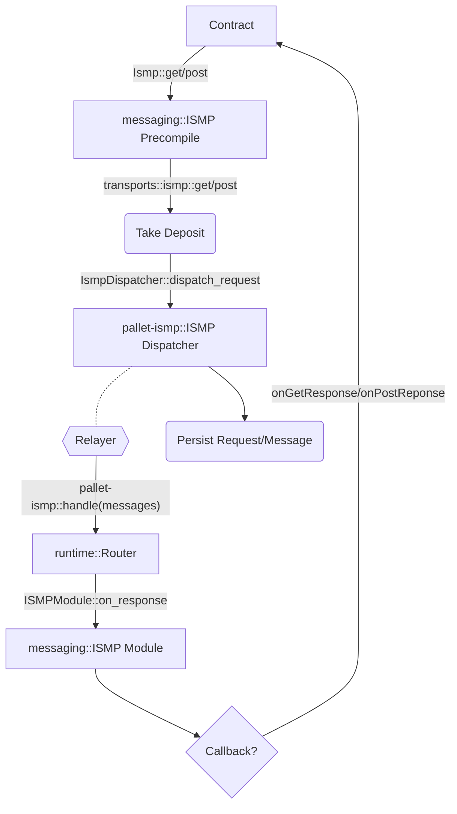
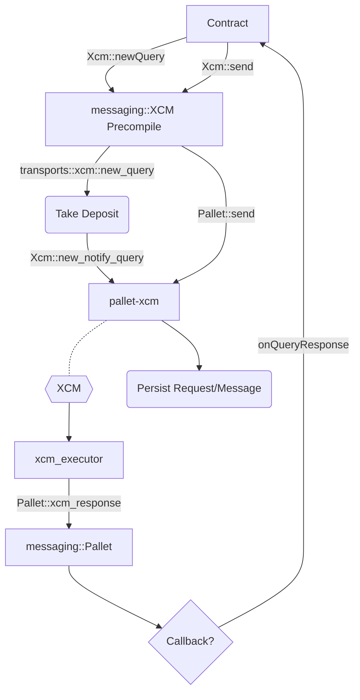

# Messaging API

The messaging API offers a streamlined interface for cross-chain interactions. The goal is to provide a simplified API that unlocks the power of Polkadot for contracts.

## ISMP
The following diagram illustrates the flow of the ISMP implementation:

## XCM
The following diagram illustrates the flow of the XCM implementation:

## Weights

A description on how fees, blockspace and weights are handled can be found [here](weights.md).
