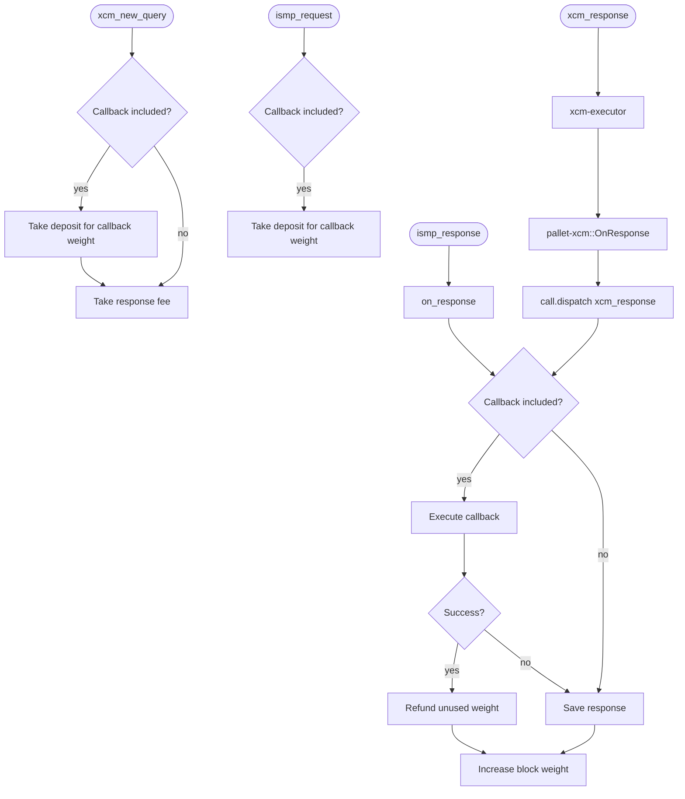

# Weights, fees and blockspace

## Context
In messaging, ISMP relayers and XCM response are handled very differently hence, some background is required to appreciate why fees, blockspace and weights are handled as they are.
Generally it comes down to **how the response is called** and from this we can deduce how pallet-api must react.
In these cases it is either directly via `call.dispatch(origin)` where call is a type that implements `Dispatchable` or via a transaction, the normal route to dispatch a call.

Furthermore, on the subject of calling into a contract environment, we have a similar case to using call.dispatch, using a method like bare_call does not increase block weight or handle fees. We are outside the normal flow of dispatching.

### XCM
In the case of XCM we are heavily dependant on the __slightly unfinished__ version of pallet-xcm's OnResponse implementation. In the current version (2412) the RuntimeCall is decoded and dispatched directly, the function on_response returns a weight, which is ignored by the xcm-executor. This means fees are not charged, weight is not tracked and we must handle these ourselves on a pallet level.

It is important to note that we **must** follow any changes to the xcm-executor and pallet-xcm regarding QueryResponses closely to avoid any potentially critical issues. Especially around the max_weight field in the QueryResponseInfo which is **contract defined** and hence a place of vulnerability.

In our case this max_weight will be ignored and setting to Weight::Unlimited is the best option from a contract developers perspetive.

The process is then as follows: 

1. Query: 
    - Charge the caller for the weight of the request extrinsic only.
    - Take a deposit for the callback execution.
    - Take a fee for the response and the cost to call the CallbackExecutor.

This ensures that fees are paid for the request, the response and we are holding fees for the callback.
The weight used is equal to the request only. 

2. Response:
    - Aggregate the response weight and the callback weight and ensure we have enough blockspace for the worst case.
    - Execute the callback and return the actual weight used.
    - Increase BlockWeight by the weight of the response and the callback and callback execution.
    - Return any left over weight to the origin.

The fees have been paid in the Query except for the callback gas (which is a deposit). We only need to manage response weight alongside the callback weight and fees. 
Simple enough ay?

### ISMP
For ISMP we are in normal substrate territory, calls are handled via the ismp-pallet's `handle` extrinsic. This greatly simplifies the flow. 
ISMP responses are handled by the IsmpModule trait and its weight via IsmpModuleWeights.
The IsmpModuleWeight is aggregated into the pallet-ismp's `handle` extrinsic, handling our fees and weights normally for the response weight and the CallbackExecutor's `execution_weight()`,  _sigh_.
We still have to manage the callbacks weight. 

The process therefore is much simpler: 

1. Request:
    - Charge the caller the weight of the request extrinsic only.
    - Take a deposit for the callback execution.

2. Response: 
    - Using only the callback weight ensure we have enough blockspace.
    - Execute the callback and return weight used.
    - Increase blockspace by only weightused.
    - Return any left over weight.

Then i think, and hope, we are safe.

