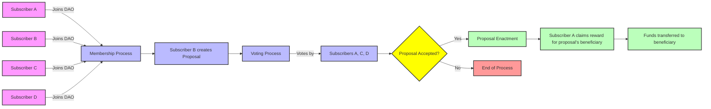

# PSP22 DAO contract example

## Description
This contract implements a Decentralized Autonomous Organization using Psp22.
The objectivbe of this DAO is to allow its members to vote for funding of projects they would like to see developped.
To become a member, a user needs to pay some amount of the Dao_token to the Dao Treasury(Dao_tokens obtained through airdrops or token purchase...) ⇒ The subscription payment becomes the Member voting_power. 
Approved projects are funded by the Dao Treasury.  
The key functionalities include:
- **Membership Management**: It maintains a registry of DAO members.
- **Proposal Lifecycle**: The contract manages the creation, voting, and execution of proposals. Each proposal includes details like description, voting period, vote tallies, execution status, beneficiary, and amount to be awarded.
- **Voting Mechanism**: It implements a voting system where members can vote with their balance on proposals. The contract tracks voting periods and maintains vote counts for each proposal.
- **Token Integration**: The DAO is associated with a specific Psp22 token_id.
- **Governance Parameters**: governance parameters such as voting periods are customizable.
- **Vote Tracking**: The contract keeps track of when members last voted.
- **Proposal Execution**: Once a proposal's voting period ends and passes, the contract handles its execution: transferring funds to the chosen beneficiary.

## Dao Workflow
- **Subscription**: The first step is membership: users use their funds* to join the Dao, become members, and determine their voting power, as membership gives them the right to vote on the use of the Dao Treasury.
- **Proposal**: Dao members can create spending proposals for the treasury. At the moment, the voting period for the proposal is given by the proposal creator, but this could be a Dao parameter, determined by the creator of the Dao contract.
- **Vote**: Members of the Dao can vote for or against a given proposal, through the selection of the corresponding proposal ID. The vote has to be cast within the voting period of the selected proposal.
- **Proposal enactment**: After the end of the voting period, If the proposal has been accepted by the Dao Members, the proposal can be enacted, i.e. funds can be claimed/transferred to the account specified as the beneficiary in the proposal. Any member can claim the reward for the winning proposal.

*It is assumed that after Dao & associated token creation, potential members own the Dao Token through airdrop, token purchase, etc... (These mechanisms are not part of the contract). 

### Flowchart

